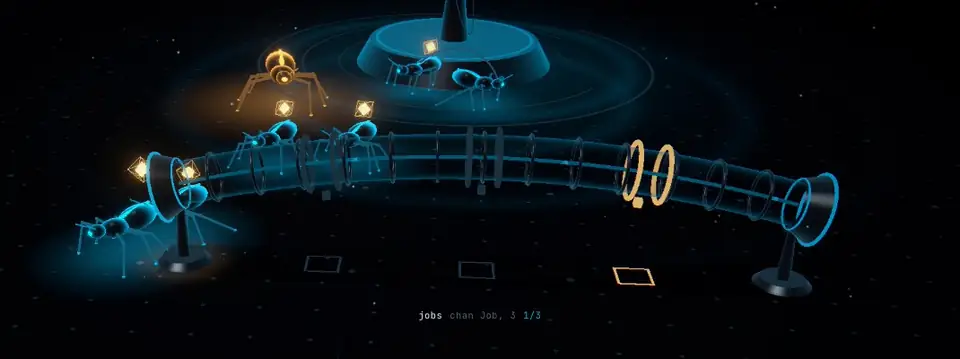

<div align="center">

# Goroutine Colony

**What if the Go runtime was alive?**

Go concurrency, shown as a living colony of creatures you can watch.

[**▶ Open the live demo**](https://goroutine-colony.vercel.app) · [How to read it](#how-to-read-the-colony) · [The five stories](#the-five-stories) · [Real backend mode](#real-backend-mode-seatrush) · [Run locally](#run-it-locally)

[](https://goroutine-colony.vercel.app)
[](LICENSE)




<sub>A channel with 3 slots fills up. The 4th and 5th senders turn red and wait at the entrance. The sleeping consumer wakes, takes a value, and one stuck sender gets in.</sub>

</div>

---

## What is this?

Programs written in **Go** do many things at once using **goroutines**. The trouble is that you can't *see* any of it. Whether a goroutine is working, stuck, or waiting on another happens invisibly inside the runtime, and that is where the hardest bugs live.

**Goroutine Colony makes it visible.** Every goroutine becomes a small creature. Channels, locks and shared memory become physical structures in a world. When a goroutine gets stuck, you see it get stuck. When two of them corrupt the same data, the world glitches. When the whole program deadlocks, everything freezes.

You don't need to read any code to follow it. The motion tells the story.

---

## New to Go? The 30-second version

| Idea | In plain words |
|---|---|
| **Goroutine** | A small independent task. A Go program can run thousands at the same time. |
| **Channel** | A pipe for handing values from one goroutine to another. |
| **Unbuffered channel** | A handshake: the sender waits until someone is there to take the value. |
| **Buffered channel** | A pipe with a small waiting room (say, 3 slots). Senders only wait when it's full. |
| **Mutex (lock)** | A door that lets one goroutine in at a time. Everyone else queues outside. |
| **Data race** | Two goroutines change the same data at the same moment without a lock. One change gets lost. |
| **Deadlock** | Everyone is waiting for someone else. Nothing can ever move again. |

---

## How to read the colony

| You see | It means |
|---|---|
| 🐜 A small creature | A goroutine. The **big** one near the core is `main`. |
| Its glowing stripe in **cyan** | Running: doing work. |
| In **red**, pressing forward | **Blocked**: it wants to continue but can't, e.g. the channel is full or the lock is taken. |
| In **amber** | Waiting for something to arrive. |
| In **violet**, low to the ground | Sleeping (`time.Sleep`). |
| Dissolving into dust | The goroutine finished. |
| 💎 A gold diamond on its back | A value being passed around (a "job"). |
| 🧪 A glass tube | A **channel**. Glowing rings on it are buffer slots. A red tube is jammed. |
| 🔒 A round cage with a padlock | A **mutex**. Raised gate bars mean locked. Red means others are queuing. |
| ▢ A floating cube with a number | **Shared memory**, like a counter. |
| 🌀 The spinning tower at the back | The Go runtime. New goroutines hatch from it. |
| A ring wave on the floor | Something just happened: a send, a lock, a write. |

The **code panel** (bottom left) shows the Go program, with a chip for each goroutine on the line it's currently running. The **trace** (bottom right) is the live event stream.

---

## The five stories

Pick them from the bar at the bottom of the demo, or press `1`–`5`.

### 1 · CHANNEL: a handshake
A producer brings a job to an **unbuffered** channel, but nobody is there to receive it, so it **waits at the entrance, red**, holding the job. When the consumer arrives at the other end, the job shoots through the tube in one hand-off and both carry on.
> **Lesson:** on an unbuffered channel, a send and a receive must meet.

### 2 · BUFFER: the waiting room fills up
`make(chan Job, 3)`. Five producers each drop a job into a channel with three slots. The slots fill, **the tube turns hot red**, and the last two producers get stuck outside. The consumer is still asleep. When it wakes and takes a job, one slot frees and a stuck producer immediately gets in.
> **Lesson:** a buffer absorbs bursts, but once it's full, senders block.

### 3 · MUTEX: one at a time
Five goroutines each want to add 100 to a shared `balance`. Only one is allowed **inside the cage**; the rest **queue at the gate, red**. Each one inside reads the balance, writes the new value, unlocks, and the next one enters. The final balance is exactly 500.
> **Lesson:** a lock makes goroutines take turns, and that waiting is the cost of correctness.

### 4 · RACE: a lost update
Two goroutines each run `counter++` three times, with **no lock**. `counter++` is really three steps: read, add one, write. When both read the same value before either writes, one increment disappears. At that moment the memory cell **tears apart**, the screen glitches, and **DATA RACE** appears. The counter ends at 4 instead of 6.


> **Lesson:** without synchronization, the result depends on timing, and timing lies.

### 5 · DEADLOCK: everyone waits forever
Two goroutines each grab one lock (`muA`, `muB`), then each tries to grab the other's. Their ownership lines and waiting lines cross into a **closed loop**. The other workers finish one by one, the colony **goes quiet and freezes**, and then Go's real error message types out:
`fatal error: all goroutines are asleep - deadlock!`


> **Lesson:** take locks in a consistent order, or this is what happens.

Nothing in these stories is pre-animated. Each scenario is a small Go-style program running on a tiny scheduler with real channel, mutex and WaitGroup rules, so blocking, the race and the deadlock all emerge on their own.

---

## Real backend mode: SeatRush


The colony can also watch a **real Go program** while it runs.

In this demo, **SeatRush** (a Go ticket-booking API) gets **50 real HTTP requests at the same instant, all trying to book the same seat**. Each request becomes a creature. They crowd the gate of SeatRush's actual lock. One gets in, sees the seat is `AVAILABLE`, marks it `HELD`, and walks home with a gold **201 RESERVED**. The other 49 get in one at a time, find the seat taken, and peel away with **409**.

- **The results are real.** The success and conflict counts are SeatRush's actual HTTP responses; the animation never decides who wins.
- **It's slowed down, not rearranged.** Real requests finish in about a millisecond, so the colony replays them in slow motion, keeping the exact order they happened in.
- **There's a broken mode for comparison.** With `SEATRUSH_DEMO_UNSAFE=true`, SeatRush checks the seat and claims it in two separate steps. All 50 buyers "win" the same seat, and the colony flags a **DOUBLE BOOKING**.

### Connect your own Go program

Open the colony with a WebSocket address:

```
https://goroutine-colony.vercel.app/?ws=ws://localhost:7070/colony
```

> Browsers restrict a public `https` page from reaching `localhost`. Chrome asks for local-network permission; other browsers may refuse. The simplest route is to run the colony locally (`npm run dev`) and open `http://localhost:5173/?ws=ws://localhost:7070/colony`.

Then stream JSON events like these from your program, one object or an array per message:

```jsonc
{"type":"RUN_START","t":0,"program":"myapp"}
{"type":"STREAM_INFO","t":0,"app":"MyApp","title":"MYAPP — LIVE","fields":[{"k":"Mode","v":"SAFE"}]}
{"type":"MUTEX_MAKE","t":0,"mu":"mu"}
{"type":"MEMORY_ALLOC","t":0,"mem":"seat-3","label":"seat 3","group":"seats","value":"AVAILABLE","tone":"calm"}
{"type":"GOROUTINE_SPAWN","t":0.001,"gid":18,"fn":"POST /reservations","label":"req-18","at":"core"}
{"type":"MUTEX_WAIT","t":0.001,"gid":18,"mu":"mu"}
{"type":"MUTEX_LOCK","t":0.002,"gid":18,"mu":"mu"}
{"type":"MEMORY_READ","t":0.002,"gid":18,"mem":"seat-3","value":"AVAILABLE","tone":"calm"}
{"type":"MEMORY_WRITE","t":0.002,"gid":18,"mem":"seat-3","value":"HELD","tone":"warm"}
{"type":"MUTEX_UNLOCK","t":0.002,"gid":18,"mu":"mu"}
{"type":"GOROUTINE_DONE","t":0.003,"gid":18,"outcome":"success","status":"201 RESERVED"}
```

Positions are optional; the colony lays things out itself. Every event type is defined in [`src/simulation/events.ts`](src/simulation/events.ts).

---

## Run it locally

```bash
git clone https://github.com/shxwat/goroutine-colony.git
cd goroutine-colony
npm install
npm run dev        # → http://localhost:5173
```

Production build: `npm run build && npm run preview`

Link straight to a story with `?scenario=channel`, `buffer`, `mutex`, `race` or `deadlock`.

### Controls

| Key / action | Does |
|---|---|
| `1` – `5` | Switch scenario |
| `Space` | Pause / resume |
| `R` | Replay |
| `M` | Sound on / off (starts muted) |
| Drag · Scroll | Orbit · Zoom |
| Click a creature | Follow that goroutine (`Esc` to stop) |
| Hover anything | See its details: state, what it's waiting on, buffer fill, lock owner |

---

## How it's built

```
Scenario program ──► virtual scheduler ─┐
                                        ├─► event stream ─► world state ─► 3D renderer
Real Go app ──► WebSocket ──► director ─┘                └─► effects · camera · sound · UI
```

The 3D world never runs the logic. It only reacts to a stream of events (`GOROUTINE_SPAWN`, `MUTEX_WAIT`, `MEMORY_WRITE`, …). The same renderer works for the built-in scenarios and for a live Go backend.

| Folder | What's inside |
|---|---|
| [`src/simulation/`](src/simulation) | The event protocol, the world state, the mini Go scheduler, the live WebSocket source and slow-motion director. |
| [`src/scenarios/`](src/scenarios) | The five stories, written as Go-style programs, plus the Go source shown on screen. |
| [`src/entities/`](src/entities) | The creature: a six-legged walker with procedural gait and leg IK. |
| [`src/scene/`](src/scene) | Everything 3D: creatures, channels, cages, memory cells, the runtime core, the camera director, effects. |
| [`src/ui/`](src/ui), [`src/store/`](src/store) | The overlay: stats, code panel, trace, tooltips, verdicts. |
| [`src/audio/`](src/audio) | Sound, generated in code with Web Audio. No audio files. |

Built with **TypeScript, React, Three.js (React Three Fiber), zustand and Vite**. Creatures, legs and effects are drawn with GPU instancing, and per-frame motion never goes through React. It holds a steady 120 fps on an M-series MacBook and lowers its resolution automatically on weaker machines instead of stuttering.

---

## License

[MIT](LICENSE) © shxwat
