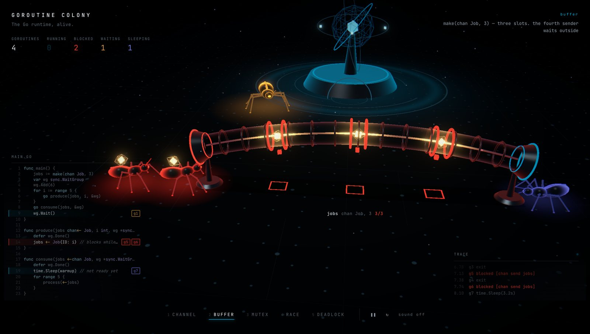
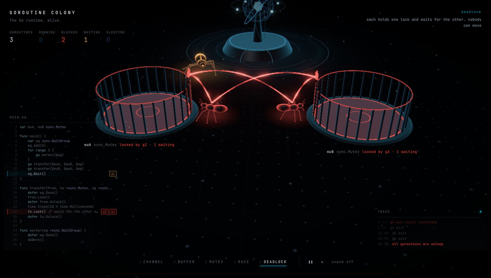
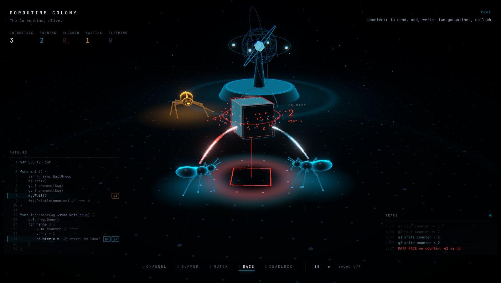
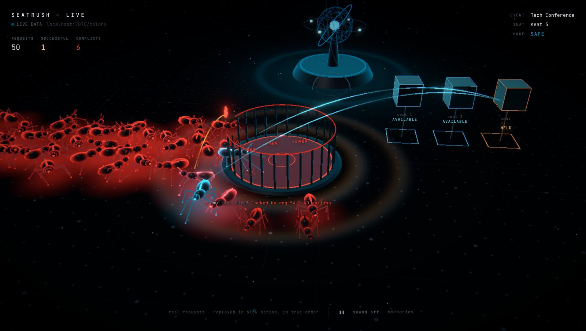

# Goroutine Colony

**What if the Go runtime was alive?**

Goroutine Colony turns Go concurrency into a living world. Every goroutine is a small procedural creature. Channels are glass conduits with physical buffer slots, mutexes are caged chambers with gates, and shared memory floats as cells you can watch being read and written. Blocking, contention, races and deadlocks are shown as behaviour, not as text.

It runs two ways:

- **Scenarios:** five small Go programs executed by a deterministic in-browser runtime.
- **Live:** a real Go backend streams instrumentation events over WebSocket, and its real HTTP requests appear as creatures.



---

## Scenarios

| | What you see |
|---|---|
| **CHANNEL** | An unbuffered send. The sender waits at the entrance holding its value until a receiver arrives, then the value crosses in one hand-off. |
| **BUFFER** | `make(chan Job, 3)`. Three cradles fill, the conduit runs hot, and the fourth and fifth senders jam red at the port until the consumer frees a slot. |
| **MUTEX** | One goroutine inside the chamber, the gate closed behind it. Everyone else queues outside, pressing against the bars. |
| **RACE** | `counter++` from two goroutines with no lock. Their read-modify-write windows overlap, the cell tears into colour ghosts, and the value settles on the wrong number. |
| **DEADLOCK** | Two goroutines each hold one lock and wait for the other. Their ownership and wait lines close into a loop, the colony freezes, and then the runtime prints its verdict. |





Nothing in the scenarios is hand-timed. Each one is a Go-like program written as generator coroutines (`yield go.send('jobs', job)`), and a small virtual scheduler with real channel, mutex and WaitGroup semantics decides when each goroutine runs. Blocking, wake-ups, race detection (lost updates) and deadlock detection ("all goroutines are asleep") come out of those rules.

The code panel pins every goroutine to the line it is executing, and the trace panel shows the event stream as it happens.

---

## Live mode: a real Go backend



Point the colony at any process that streams Colony events:

```
http://localhost:5173/?ws=ws://localhost:7070/colony
```

The first producer is **SeatRush**, a Go ticket-booking API. Fifty concurrent `POST /reservations` requests for the same seat hatch as fifty creatures and crowd the gate of SeatRush's real `sync.Mutex`. One gets in, reads the seat as `AVAILABLE`, flips it to `HELD`, and walks home with its reservation under a gold **201**. The other forty-nine read `HELD` and peel away with **409**.

The counts on screen are SeatRush's actual HTTP status codes. Nothing in the animation decides the result; the backend is the source of truth.

How it works:

- **Correlation.** Each HTTP request gets a correlation ID (`req-N`, returned in `X-Request-ID`) that maps to one goroutine and one creature for its whole lifecycle.
- **Slow motion in true order.** Real requests finish in about a millisecond, so the colony replays the stream in slow motion. It preserves every happens-before relation: per goroutine, per mutex and per memory cell. The only thing it adds is walking motion, never outcomes or ordering.
- **Not tied to SeatRush.** The frontend knows nothing about SeatRush. It speaks a generic concurrency protocol, and the producer describes itself with a `STREAM_INFO` event.

### Streaming from your own Go program

Send JSON events (one object, or an array per message) over a WebSocket:

```jsonc
{"type":"RUN_START","t":0,"program":"myapp"}
{"type":"STREAM_INFO","t":0,"app":"MyApp","title":"MYAPP — LIVE","fields":[{"k":"Mode","v":"SAFE"}]}
{"type":"MUTEX_MAKE","t":0,"mu":"mu"}
{"type":"MEMORY_ALLOC","t":0,"mem":"seat-3","label":"seat 3","group":"seats","value":"AVAILABLE","tone":"calm"}
{"type":"GOROUTINE_SPAWN","t":0.001,"gid":18,"fn":"POST /reservations","label":"req-18","at":"core"}
{"type":"MUTEX_WAIT","t":0.001,"gid":18,"mu":"mu"}
{"type":"MUTEX_LOCK","t":0.002,"gid":18,"mu":"mu"}
{"type":"MEMORY_READ","t":0.002,"gid":18,"mem":"seat-3","value":"AVAILABLE","tone":"calm"}
{"type":"MEMORY_WRITE","t":0.002,"gid":18,"mem":"seat-3","value":"HELD","tone":"warm"}
{"type":"MUTEX_UNLOCK","t":0.002,"gid":18,"mu":"mu"}
{"type":"GOROUTINE_DONE","t":0.003,"gid":18,"outcome":"success","status":"201 RESERVED"}
```

Layouts are optional: resources without positions are placed automatically. The full protocol is typed in [`src/simulation/events.ts`](src/simulation/events.ts).

---

## Architecture

```
Scenario program ──► VirtualRuntime ─┐
                                     ├─► ColonyEvent stream ─► World.apply() ─► renderer (read-only, per frame)
Go app ─► WebSocket ─► LiveDirector ─┘                       └─► EventBus ─► FX · camera · sound · UI (throttled)
```

- **`src/simulation/`**: the protocol (`events.ts`), the world model (`world.ts`, the only place state changes), the shared spatial layout, the virtual scheduler, the WebSocket source with reconnect, and the live director.
- **`src/scenarios/`**: the five programs and their Go source.
- **`src/entities/`**: the creature. A pure-TypeScript hexapod with tripod gait and two-bone IK legs.
- **`src/scene/`**: React Three Fiber rendering. Instanced bodies, legs and payloads; shader conduits; mutex chambers; memory cells; the floor; the runtime core; the camera director; post-processing.
- **`src/ui/`, `src/store/`**: the DOM overlay and a zustand store, fed by the event stream at most once per frame.
- **`src/audio/`**: procedural WebAudio. No audio files; starts muted.

Per-frame motion never goes through React. Creatures, legs, payloads and links are instanced, and the renderer adapts its pixel ratio to hold the frame rate. On an M-series MacBook it runs at a steady 120 fps.

---

## Run it

```bash
npm install
npm run dev          # http://localhost:5173
```

```bash
npm run build && npm run preview   # production build
```

Deep links: `/?scenario=channel|buffer|mutex|race|deadlock`, or `/?ws=ws://host:port/path` for live mode.

### Controls

| | |
|---|---|
| `1`–`5` | switch scenario |
| `Space` | pause |
| `R` | replay |
| `M` | sound on/off |
| drag / scroll | orbit / zoom (the camera returns on replay) |
| click a goroutine | follow it (`Esc` to stop) |
| hover | inspect a goroutine, channel, mutex or memory cell |

---

Built with TypeScript, React, Three.js / React Three Fiber, zustand and Vite.

## License

[MIT](LICENSE)
